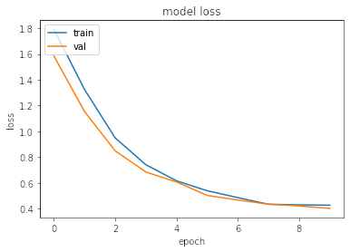
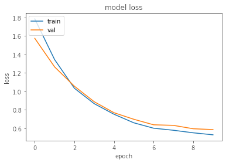
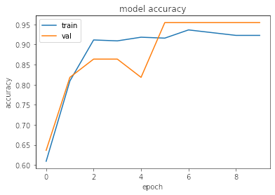
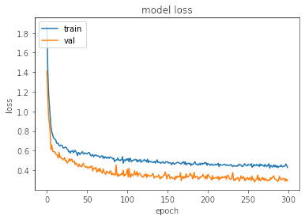
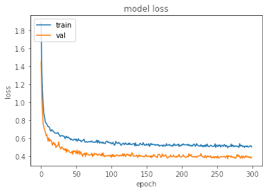
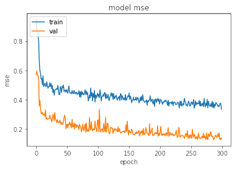

# RadiationML
Below is a quick overview of each project.

## ACLK data - detection by noise
Used LPM 0, 2, and 4. Each used the raw data from trials from 0-11.

Overall results: Need more data to get the models more accurate. Lower power modes are harder to detect even at high dosage, possibly due to less systems being used and overall less nosie.

### [RawDoseClassification](RawDoseClassification.ipynb)
Classification into two groups, 0-25, or 25+.

Result: Very accurate after short training time. Could add more classes. I used the regression model architecture for this but it can probably be simplified.

Loss:  
  
  
  

Accuracy:  
  
  
  

### [RawDoseRegression](RawDoseRegression.ipynb)
These models tried to predict the dosage.

Result: This required much more hyperparameter tuning as well as a slightly more complex model to capture the data. LPM0 had very low error, and was rougly correct almost every time.
LPM4 had decent error, but still had some very incorrect predictions (predicted 0, expected 50 or vice verse).

Loss:  
  
  
  

MSE:  
  
  
  

## Single-Event Transients (SETs)

### [SupervisedAnomalyClassification](SupervisedAnomalyClassification.ipynb)
Used LBNL data and hand labeled dataset to perform classification to distinct SET signature using raw data.

Result: High accuracy on low training data but not very robust need more data to continue with supervised training.
